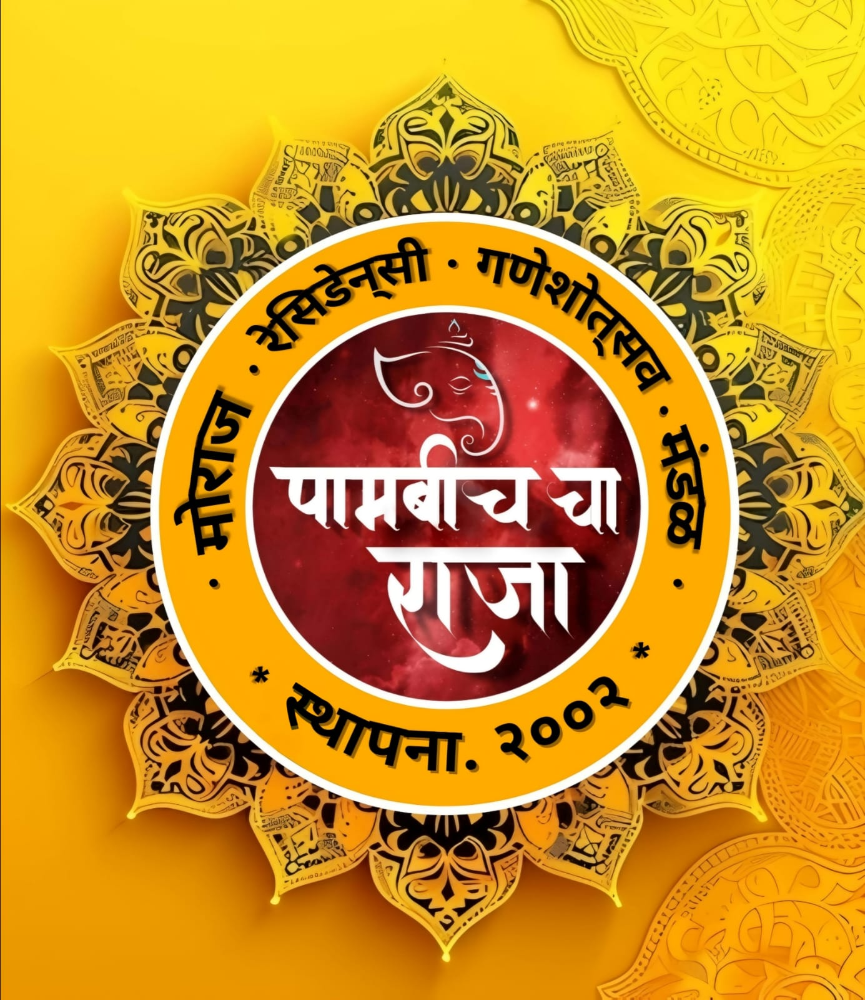

# Moraj Ganeshotsav Mandal Website

A dynamic and interactive website for the Moraj Ganeshotsav Mandal community celebration, built using React.



## 📌 Overview

This website serves as a digital platform for the Moraj Society's annual Ganeshotsav celebration, featuring event details, registration, gallery, and community information. The 10-day festival brings together residents from 32 buildings to celebrate with devotion and cultural activities.

## ✨ Features

- **Responsive Design**: Optimized for all devices from mobile to desktop
- **Interactive Event Calendar**: Browse and filter events throughout the festival
- **Countdown Timer**: Dynamic countdown to the next Ganeshotsav celebration
- **Photo Gallery**: Showcase of past celebrations and events
- **Community Engagement**: Testimonials, volunteer registration, and newsletter subscription
- **Smooth Animations**: Enhanced user experience with subtle animations

## 🛠️ Technology Stack

- **Frontend**: React.js
- **Routing**: React Router
- **Styling**: CSS with custom styling and responsive design
- **Animations**: AOS (Animate On Scroll) library
- **Deployment**: [Specify your deployment platform]

## 🚀 Installation and Setup

```bash
# Clone the repository
git clone https://github.com/yourusername/moraj-ganeshotsav.git

# Navigate to the project directory
cd moraj-ganeshotsav

# Install dependencies
npm install

# Start the development server
npm run dev

# Build for production
npm run build
```

## 📁 Project Structure

```
moraj-ganeshotsav/
├── public/
│   ├── images/           # Static images
│   └── index.html        # HTML template
├── src/
│   ├── components/       # Reusable components
│   │   ├── Hero.jsx
│   │   ├── CountdownTimer.jsx
│   │   ├── EventCard.jsx
│   │   └── ...
│   ├── pages/            # Page components
│   │   ├── Home.jsx
│   │   ├── About.jsx
│   │   ├── Events.jsx
│   │   └── ...
│   ├── App.jsx           # Main application component
│   ├── main.jsx          # Application entry point
│   └── index.css         # Global styles
├── package.json          # Project dependencies and scripts
└── README.md             # Project documentation
```

## 📝 Usage Guidelines

### Home Page
The home page showcases key information about the festival including:
- Festival introduction
- Countdown to the next celebration
- Featured events
- Gallery preview
- Community testimonials

### Event Management
Browse and register for various events throughout the 10-day celebration. Event categories include:
- Religious ceremonies
- Cultural performances
- Children's activities
- Community service initiatives

## 👥 Contributing

Contributions are welcome! Please feel free to submit a Pull Request.

1. Fork the project
2. Create your feature branch (`git checkout -b feature/AmazingFeature`)
3. Commit your changes (`git commit -m 'Add some AmazingFeature'`)
4. Push to the branch (`git push origin feature/AmazingFeature`)
5. Open a Pull Request

## 📋 Future Enhancements

- [ ] Online donation system
- [ ] Event registration system
- [ ] User accounts for community members
- [ ] Live streaming of key ceremonies
- [ ] Interactive maps for procession routes
- [ ] Multi-language support

## 📄 License

This project is licensed under the MIT License - see the LICENSE file for details.

## 📞 Contact

For any queries or suggestions, please reach out to:
- **Email**: [your-email@example.com]
- **Website**: [your-website.com]

---

© 2023 Moraj Ganeshotsav Mandal. All Rights Reserved.